# Boomerang Navigation

A cinematic single-page website featuring a unique, high-performance **3D Boomerang Transition** between themed sections. Built using clean, responsive, and performance-optimized vanilla HTML, CSS, and JavaScript.

<video controls src="boomerang navigation.mp4" title="Boomerang navigation" width="100%"></video>

---

## Key Features

- 🛸 **Cinematic Boomerang Transition**: A 3D metallic boomerang SVG that sweeps across the screen in a physical, parabolic flight path, rotating and tilting dynamically during page changes.
- ⚡ **Dynamic Shockwave Effects**: Custom air pressure distortion shockwaves (`airPressureShockwave`) applied to content and navbar elements precisely at the transition's peak.
- 🎨 **Three Curated Cinematic Themes**: Distinct visual experiences for Home, Work, and Contact pages, complete with custom color spaces, gradients, typography, and noise overlays.
- 📱 **60 FPS Mobile Optimization**: Optimized animations, 2D transforms, and flat layout structures for screens under `768px` to bypass filter bottlenecks and run butter-smooth on mobile GPUs.
- 🖋️ **Editorial-Grade Typography**: Uses the premium pairing of **Inter** and italicized **Playfair Display** from Google Fonts for an editorial, publication-style feel.
- 📻 **Noise Texture Overlays**: Custom, subtle radial gradient dot structures layered over sections for added tactile depth and a tactile analog aesthetic.

---

## Project Structure

```text
boomerang-navigation/
├── index.html               # Semantic HTML structure & custom SVG artwork
├── app.js                   # Navigation event loop, state, & phased timing logic
├── style.css                # Layout, typography, custom themes, and keyframes
├── boomerang navigation.mp4 # Video demonstration of the cinematic transition
└── README.md                # Project documentation
```

---

## Cinematic Themes & Sections

### 1. Home (`#home`)
* **Branding**: "Drift"
* **Theme**: Deep dark cinematic theme (`.theme-home`).
* **Visuals**: Cosmic dark blue-gray radial gradient background (`#131720` to `#060709`) with intense cyan and magenta chromatic aberration accent shadows.
* **Text**: Elegant crisp white gradient heading.
* **Subtitle**: *"Immersive Motion & Cinematic Direction"*

### 2. Work/Archive (`#work`)
* **Branding**: "Archive"
* **Theme**: Modern editorial light theme (`.theme-work`).
* **Visuals**: Clean, stark white background (`#ffffff`) with deep slate-gray text.
* **Typography**: Italicized, high-impact serif typography.
* **Subtitle**: *"Selected Case Studies • 2026 Edition"*
* **Detail**: Very subtle, high-density black radial-dot noise overlay (1.5% opacity).

### 3. Contact (`#contact`)
* **Branding**: "Resonance"
* **Theme**: Warm, tactile beige theme (`.theme-contact`).
* **Visuals**: Earthy beige background (`#eae3d2`) with rich brown typography (`#1c1915`).
* **Subtitle**: *"Connect Designation • Transmit Signal"*
* **Detail**: Earthy brown radial dot noise overlay (2% opacity).

---

## Under the Hood: Technical Architecture

### CSS Custom Properties (Theme Tokens)
Custom variables allow us to adjust the shadow values dynamically per theme to keep the shockwave chromatic aberration sharp and contrasting:
```css
.theme-home {
    --distort-shadow-1: -1.5px 0.5px 0px rgba(0, 240, 255, 0.4);
    --distort-shadow-2: 1.5px -0.5px 0px rgba(255, 0, 128, 0.4);
}
.theme-work {
    --distort-shadow-1: -1.5px 0.5px 0px rgba(15, 17, 21, 0.25);
    --distort-shadow-2: 1.5px -0.5px 0px rgba(180, 180, 180, 0.35);
}
.theme-contact {
    --distort-shadow-1: -1.5px 0.5px 0px rgba(28, 25, 21, 0.25);
    --distort-shadow-2: 1.5px -0.5px 0px rgba(140, 130, 115, 0.35);
}
```

### Dynamic Animations & Keyframes
- **`cutScreen`**: A `2.4s` parabolic flight path built with a customized cubic-bezier curve (`.77, 0, .18, 1`) scaling up to `6.2x` at its peak to sweep the viewport.
- **`floatTilt` & `spin`**: Independent layered components creating a combined 3D wobble and continuous spinning effect on the boomerang.
- **`airPressureShockwave`**: Content is temporarily skewed, scaled, blurred, and chromatic shadow offsets are applied during the middle of the transition to simulate air displacement.
- **`navbarShockwave`**: Subtle upward translation and scaling of the header coinciding with the sweep of the boomerang.

### Mobile Optimizations
To preserve battery life and maintain a stable 60 FPS on lower-tier mobile chips, style rules under `@media (max-width: 768px)` apply key optimizations:
1. **Flat Rendering (`transform-style: flat;`)**: Bypasses expensive 3D perspective math on mobile GPUs.
2. **Filter Exclusions (`filter: none !important;`)**: Removes expensive CSS drop-shadow filters on mobile to prevent paint bottlenecks.
3. **2D Flight Coordinates (`cutScreenMobile`)**: Simplifies coordinate scaling and translation vectors for responsive screen sizes.

---

## Phased Navigation Cycle

The transitions are orchestrated by `app.js` through a precise three-phase event sequence:

```mermaid
sequenceDiagram
    participant User
    participant JS as app.js
    participant UI as DOM / CSS
    
    User->>JS: Clicks Nav Button
    JS->>UI: Adds .active (transition) & .animate (boomerang)
    Note over UI: Boomerang takes off in flight
    
    rect rgb(28, 30, 36)
        Note over JS,UI: PHASE 1 (1200ms) - Transition Peak
        JS->>UI: Swaps section class, updates active button, sets body class
        JS->>UI: Adds .ui-react (Content Shockwave) & .navbar-react (Nav Shockwave)
    end
    
    rect rgb(38, 40, 48)
        Note over JS,UI: PHASE 2 (1800ms) - Recovery Peak
        JS->>UI: Removes .ui-react & .navbar-react (Resets shockwave for next run)
    end
    
    rect rgb(28, 30, 36)
        Note over JS,UI: PHASE 3 (2400ms) - Flight End
        JS->>UI: Removes .animate (boomerang) & .active (transition)
        JS->>JS: Resets isTransitioning = false (Unlocks Navigation)
    end
```



---

## Customization Guide

### 1. Modifying Timings
If you wish to change the speed of the flight path in `style.css` (e.g. shortening `cutScreen 2.4s` to `1.8s`), you must scale the timeouts in `app.js` proportionally:
```javascript
// Example: Scaled down for a faster 1.8s transition
setTimeout(() => { /* Swap Content */ }, 900);  // Phase 1 (50%)
setTimeout(() => { /* Clear Shockwave */ }, 1350); // Phase 2 (75%)
setTimeout(() => { /* Flight End & Unlock */ }, 1800);  // Phase 3 (100%)
```

### 2. Custom Gradients
The boomerang's polished chrome look is drawn via custom gradients embedded in the `<svg>` defs within `index.html`. You can customize the linear gradients (`#chrome-grad`, `#matte-dark-grad`, and `#silver-tip-grad`) to match your custom brand palette.

### 3. Noise density
Adjust the dot density or visual strength by updating the repeating radial gradient parameters or opacity in `style.css` under the `.noise`, `.work .noise`, and `.contact .noise` declarations.

---

## Local Development & Setup

1. **Download/Clone**: Get the code files locally.
2. **Run Server / Open File**: Because it's pure, elegant vanilla code, you can open `index.html` directly in any modern browser, or use a local utility like `Live Server` / `npx serve` to serve it.
3. **Deployment**: Completely ready to drag-and-drop onto static hosting providers such as **Netlify**, **Vercel**, **GitHub Pages**, or **Cloudflare Pages**.
